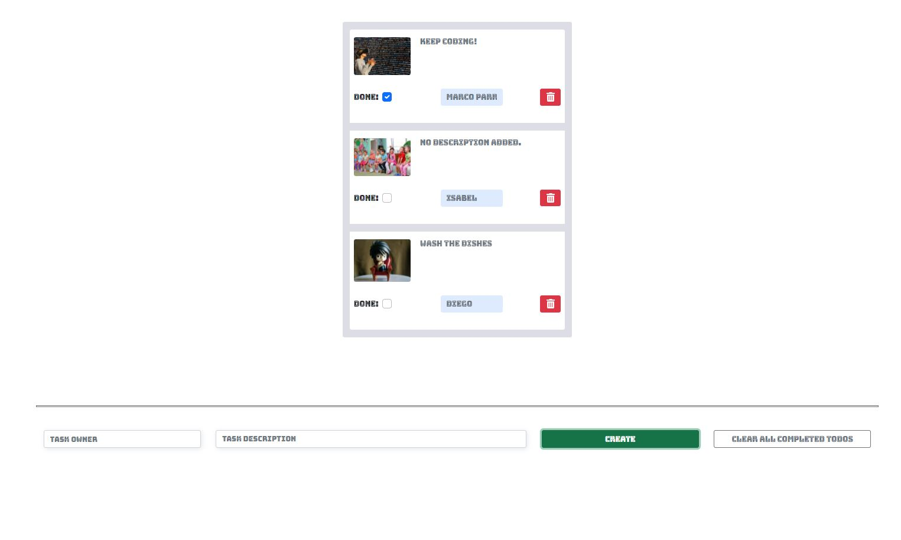

# React Todo App

> This project has a complete version of todo features. It was created using react-redux to manage all of the todo's constant changes (like CRUD events), browser's Local Storage to make data persistant, React drag-and-drop to give it a more animated action, and react-bootstrap to achieve a great look, and API features to get random pictures for each todo.

## This project was built with:

 - React.

 - React-Redux.

 - Browser's Local Storage.

 - React-boostrap (5.1 version).

 - React's own Font Awesome.

 - Pixabay's images API.

## Image Preview

## :star: [Live Demo](https://hopeful-villani-16dc54.netlify.app) :star:

## Getting Started

To get a local copy up and running follow these simple example steps:

- On the project, GitHub page, navigate to the [main page of the repository](https://github.com/mrigorir/react-todo-app)

- Click on a button named `code`

- Copy the project URL as displayed on HTTPS tab

- If you're running Windows Operating System, open your command prompt. On Linux, Open your terminal

- Change the current working directory to the location where you want the cloned directory to be made. Leave as it is if the current location is where you want the project to be.

- Type `git clone`, and then paste the URL you copied in Step 3. 

  `$ git clone git@github.com:mrigorir/react-todo-app.git` <em>Press Enter key</em> 

- Your local copy will be created.

- Please note that you must have Git installed on your PC, this can be done [here](https://gist.github.com/derhuerst/1b15ff4652a867391f03)

- After you get the project aiming to the desired directory, you need now to install dependencies by running npm install.

### Github Actions

To make sure the linters' checks using Github Actions work properly, you should follow the next steps:

1. On your recently forked repo, enable the GitHub Actions in the Actions tab.
   
2. Create the `feature/branch` and push.
   
3. Start working on your milestone as usual.
   
4. Open a PR from the `feature/branch` when your work is done.

### Usage 

- Make sure you have npm and node installed.

- I recommend the use of VS code as a code editor, but you can use any code editor.

- Run in your terminal `npm run start` OR `yarn start` to see the run the app in your default browser.

- You should see the todo form ready to be used.

- Add a name for the task owner (description is optional).

- hit create button to create your todo.

- You can either check it when DONE or remove it by hitting the trash icon.
## Authors

👤 **Marco Parra**

- GitHub: [@mrigorir](https://github.com/mrigorir)
- Twitter: [@marcoparra311](https://twitter.com/marcoparra311)
- LinkedIn: [@marco-alonso-parra](https://www.linkedin.com/in/marco-alonso-parra/)

## 🤝 Contributing

Contributions, issues, and feature requests are welcome!

Feel free to check the [issues page](https://github.com/mrigorir/react-todo-app/issues).

## Show your support

Give a ⭐️ if you like this project!

## Acknowledgments

- Creation inspired on [react-beautiful-dnd](https://react-beautiful-dnd.netlify.app/?path=/story/single-vertical-list--basic)

## 📝 License

This project is [MIT](./MIT.md) licensed.